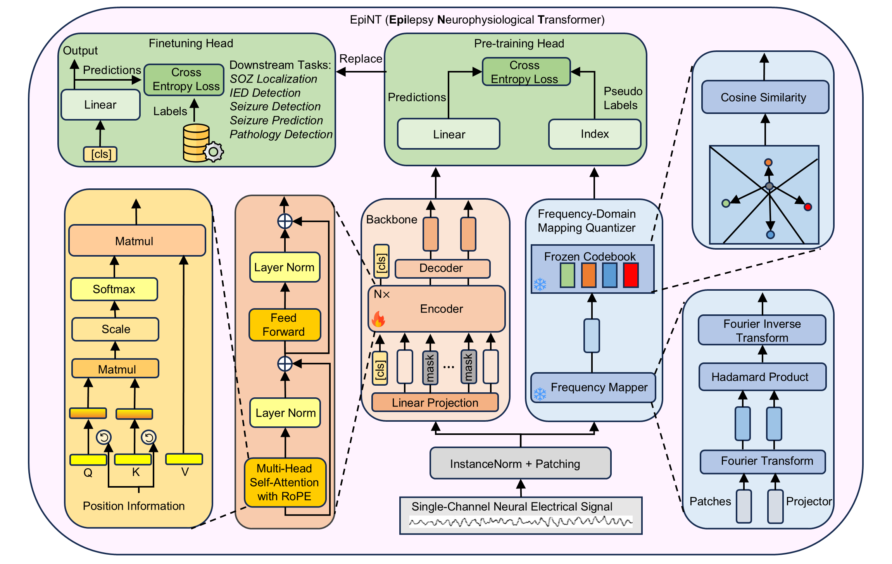

# EpiNT

Official implementation of the paper:  
**"Cross-Modal Epileptic Signal Harmonization: Frequency Domain Mapping Quantization for Pre-training a Unified Neurophysiological Transformer"**

<p align="center">
  
</p>

## 🔍 Overview

**EpiNT** is a Transformer-based pre-training framework for harmonizing **EEG** and **iEEG** signals in the context of epilepsy research and application. It uses:

- A **masked autoencoder (MAE)** architecture for pre-traububg.
- A novel, **non-trainable frequency domain vector quantizer** to discretize neural signals.
- Unified handling of both EEG and iEEG modalities.

<p align="center">
  
</p>

## 🚀 Getting Started

###  Install

Firstly, clone the github repo:

```bash
git clone https://github.com/RunKZhang/EpiNT
```

Then, move to the root directory of EpiNT, and run:

```bash
pip install .
```

to install the package to your environment. Alternatively, you can install it in editable mode:

```bash
pip install -e .
```

To reproduce our environment, we included a `requirements.txt` under the project. To use this, run:

```bash
pip install -r requirements.txt
```

### 🧪 Dataset Preparation

Since we cannot distribute the datasets, please use the links provided in scripts/dataset_list.py to download the public datasets. After downloading the dataset, please fill the file paths for raw data in `dataset_configs.yaml`.

After downloading, specify the output path in dataset_configs.yaml:

```yaml
DATASETS_OUTPUT_PATH:  /your/path/for/dataset/output
```

Then, run:

```bash
python scripts/generate_pretrain_dataset.py
python scripts/generate_downstream_datasets.py
```

Finally, you can get the output pre-training and downstream datasets in hdf5 file structure.

### 🛠 Simple Usage 

For people simply want to use the EpiNT, you can refer to the `sample_feature_extractor.ipnyb`. The model is loaded using:

```python
from epint.model.EpiNTModel import EpiNT

# args are obtained from finetune_configs.yaml
model = EpiNT(args)

# load finetune weights
finetune_weights_path = '../weights/representations.bin'
finetune_weights = torch.load(finetune_weights_path)
model.load_state_dict(finetune_weights, strict=False)
```

Then, embeddings can be easily obtained using:

```python
with torch.no_grad():
    _, embedding = model(data)
```
where `embedding` is a tensor with shape `[n_samples, 1, 512]`. It can be used for classification, interpretation or other specific application.

### 🏋️‍♀️ Pre-training and Fine-tuning

For researchers, we also provide codes for pre-training and fine-tuning EpiNT based on your dataset. To do this, firstly move to the scripts:

```bash
cd scripts
```
Then, to pretrain the model in Linux system:

```bash
bash run_pretrain.sh
```

or, to fine-tune the pretrained model on downstream tasks:

```bash
bash run_finetune.sh
```

If you are using Windows, you can directly copy the commands under run_prerain.sh, or run_finetune.sh to your command line tool, for the training of EpiNT.

Note: Do not directly run the finetune.py and pretrain.py under `/scripts`. Since we use huggingface to accelerate the training, directly running will cause error and failure of reproduction.

## 📚 API Reference

| Module | File | Function/Class | Description |
|--------|------|----------------|-------------|
| `epint/data` | `make_datasets.py` | `OneSampleDataset` | Dataset for pre-training, fetch one sample each time |
| `epint/data` | `make_datasets.py` | `DownStreamDataset` | Dataset for fine-tuning, get classification dataset |
| `epint/data` | `prep_downstream_datasets.py` | `FNUSA_MAYO, etc.` | Pre-process downstream dataset and write them to hdf5 |
| `epint/data` | `prep_pretrain_datasets.py` | `OpenNeuro, etc.` | Pre-process pre-train dataset and write them to hdf5 |
| `epint/data` | `preprocess_eeg.py` | `preprocess_func` | Detailed pre-process pipeline for dataset |
| `epint/data` | `constants.py` | `TCP_AR_01, etc.` | Some constants for processing dataset |
| `epint/model` | `EpiNTModel.py` | `EpiNT`| Main Transformer model class combining MAE and vector quantization |
| `epint/model` | `/layers/quantize.py` | `Quantize, etc.`| Specific layer definition for implementing EpiNT|
| `epint/tasks` | `base.py` | `Base` | Base class for pre-train and fine-tune tasks |
| `epint/tasks` | `pretrain.py` | `Pretrain` | Pre-train trainer class |
| `epint/tasks` | `finetune.py` | `Finetune` | Fine-tune trainer class |
| `epint/utils` | `config` | `Config` | Parser for configuration |
| `configs` | `dataset_configs.yaml` | Store paths for each raw dataset, and download links |
| `configs` | `finetune_configs.yaml` | Specific configurations for fine-tuning |
| `configs` | `pretrain_configs.yaml` | Specific configurations for pre-training |
| `configs` | `hf_accelerate_configs.yaml` | Configurations for huggingface accelerate |
| `notebooks` | `MAYO_classification.ipynb` | Reproduce of linear-probing experiments on MAYO dataset to increase credibility |
| `notebooks` | `representation_learning.ipynb` | An experiment to illustrate the embeddings of EpiNT |
| `notebooks` | `sample_feature_extractor.ipynb` | An experiment to illustrate how EpiNT's embeddings can be used to train ML classifier |
| `scripts` | `finetune.py` | Entrance for fine-tuning trainer, should be used with `run_finetune.sh` |
| `scripts` | `run_finetune.sh` | Command line for fine-tuning the model, which uses huggingface accelerate to help model training. Note: Run this to start fine-tuning, not just run `python finetune.py` |
| `scripts` | `pretrain.py` | Entrance for pre-training trainer, should be used with `run_pretrain.sh` |
| `scripts` | `run_pretrain.sh` | Command line for pre-training the model, which uses huggingface accelerate to help model training. Note: Run this to start Pre-training, not just run `python pretrain.py` |
| `scripts` | `generate_downstream_datasets.py` | Python codes for starting the pre-processing and preparation of downstream datasets. Note: Users should download each dataset firstly (which we have shown in dataset_configs.yaml), then run this. |
| `scripts` | `generate_pretrain_datasets.py` | Python codes for starting the pre-processing and preparation of pretrain datasets. Note: Users should download each dataset firstly (which we have shown in dataset_configs.yaml), then run this |
| `weights` | `finetune_on_MAYO.bin` | Fine-tuned EpiNT on MAYO dataset, which can be direstly used to see performance results |
| `weights` | `representations.bin` | Only the pre-trained backbone weights (no classification head), which is used for output embedding |
| `dataset` | `sample_data.hdf5` | Sample dataset from MAYO, for illustration in sample_feature_extractor.ipynb |


## 🧑‍💻 Authors

Maintained by:  
**Runkai Zhang**  
📧 [e-mail: [271013216[replace with at]qq.com]()]

If you have any questions, please feel free to contact.


## 📜 License

This project is licensed under the **MIT License**.  
See [`LICENSE`](./LICENSE) for details.


## ⭐ Citation

If you find this project useful, please consider starring the repository!

To cite:
